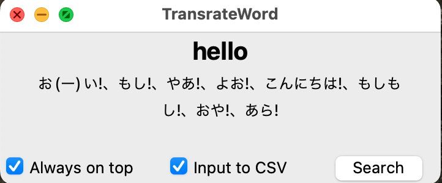

## 概要
 検索した単語を英単語帳に保存するためにCSV出力するアプリケーションです。
 対象の単語をクリップボードにコピーし、アプリケーション選択時にスペースキーまたはエンターキーを押下すると対象単語の日本語訳が表示されます。
 検索した単語は検索した際に`Trasnlated.csv`というファイルに自動で記述されます。(`Trasnlated.csv`はSource(翻訳前の単語)とTranslated(翻訳後の単語)の2列によって構成されています。)
 そのCSVファイルを英単語アプリに入力することで保存します。(英単語アプリはCSV入力できるものであれば何でも良いのですが今回は[`remaindo`](https://www.google.com/url?sa=t&source=web&rct=j&opi=89978449&url=https://apps.apple.com/jp/app/%25E5%25BF%2598%25E5%258D%25B4%25E6%259B%25B2%25E7%25B7%259A%25E3%2581%25A7%25E6%259A%2597%25E8%25A8%2598%25E3%2582%25A2%25E3%2583%2597%25E3%2583%25AA-remindo/id1058865810&ved=2ahUKEwjLrO_5ppCIAxWjbvUHHQkGJo4QFnoECAkQAQ&usg=AOvVaw1AMD9lZ3OE_Q0sWM7SHaNf)というアプリケーションを使用しています)

※ `Trasnlated.csv`の例
| Source | Translate |
| --- | --- |
| compatible | (…と)(調和して)両立できて、矛盾なく、一致して、両立式の、コンパチ式の、互換性のある |
| invent | (…を)発明する、創案する、でっちあげる、捏造(ねつぞう)する |
| cake | ケーキ、洋菓子、(薄く平たい)固いかたまり、(固形物の)1個、(魚のすり身などの)平たく固めたもの

## 実行方法
1. `rye`を[インストールする](https://rye.astral.sh)
2. `rye run python src/translateword/main.py`を実行する

## 使用方法
1. 実行するとアプリケーションが開く

2. 対象の英単語をクリップボードにコピーする
3. アプリケーション選択時にスペースキーまたはエンターキーを押下します
 

4. 検索時に`Trasnlated.csv`に自動で保存されるため単語帳アプリに入力したいときにCSVファイルを使用することができます。
### オプション機能
#### `Always on top`
- 常にアプリケーションをウィンドウの最前面にする機能
    - 他のウィンドウと重ねるときに常に最前面にするための機能
#### `Input to CSV`
- チェックボックスにチェックしているときのみCSVに入力する機能
    - CSVに入力する必要がない単語を検索する際に使用する機能
#### `Search`
- 検索に使用している[`Weblio`](https://ejje.weblio.jp)の検索ページが表示される機能
    - クリップボードのコピー内容をもとに表示される
    - 検索結果をより詳しく知りたいときに使用する

